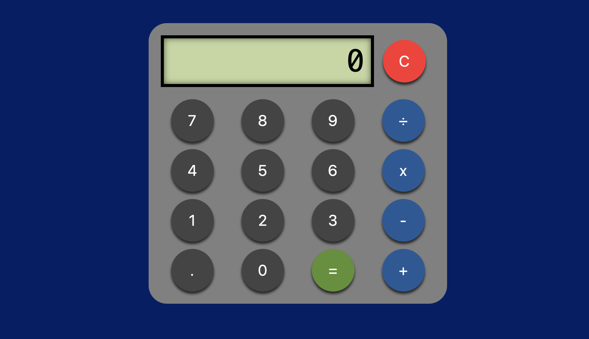

# Calculadora JavaScript

Proyecto desarrollado como ejercicio práctico para aplicar conceptos fundamentales de JavaScript, HTML y CSS.

## Descripción

Esta aplicación permite realizar operaciones matemáticas básicas mediante una interfaz gráfica similar a una calculadora tradicional.

El proyecto fue desarrollado utilizando JavaScript puro (Vanilla JavaScript), sin librerías ni frameworks externos, con el objetivo de reforzar conceptos de programación, manipulación del DOM y lógica de operaciones matemáticas.

## Funcionalidades

- Suma (+)
- Resta (-)
- Multiplicación (×)
- División (÷)
- Números decimales
- Validación de operadores consecutivos
- Validación de múltiples puntos decimales
- Prevención de división por cero
- Formato automático para números muy grandes mediante notación científica
- Historial de operaciones realizadas
- Limpieza completa de la pantalla mediante botón "C"

## Tecnologías utilizadas

- HTML5
- CSS3
- JavaScript ES6

## Estructura del proyecto

```text
calculadora/
│
├── index.html
├── assets/
│   ├── css/
│   │   └── styles_calculadora.css
│   └── js/
│       └── code.js
│
└── README.md
```

## Conceptos de programación aplicados

### Funciones

El proyecto utiliza funciones para separar responsabilidades:

- `insertar()`
- `parser()`
- `calcular()`
- `borrar()`
- `esNumero()`
- `esOperador()`

### Estructuras de control

Se aplican distintas estructuras de control:

- `if / else`
- `switch`
- `for`

### Arreglos

Se utilizan arreglos para almacenar y procesar los elementos de cada operación matemática.

### Objetos

El historial de operaciones se almacena mediante objetos JavaScript, registrando:

- Fecha
- Operación realizada
- Resultado obtenido

### Validaciones

La aplicación contempla diversas validaciones para evitar errores de uso:

- Operadores al inicio de una operación
- Operadores consecutivos
- Más de un punto decimal por número
- División por cero
- Expresiones incompletas

## Cómo ejecutar el proyecto

1. Clonar el repositorio:

```bash
git clone https://github.com/vanessaavila55-creator/m3_proyecto_calculadora.git
```

2. Abrir la carpeta del proyecto.

3. Ejecutar el archivo `index.html` en cualquier navegador moderno.

## Captura de pantalla



## Autor

Lissette Avila

Proyecto desarrollado con fines educativos para la práctica de JavaScript.